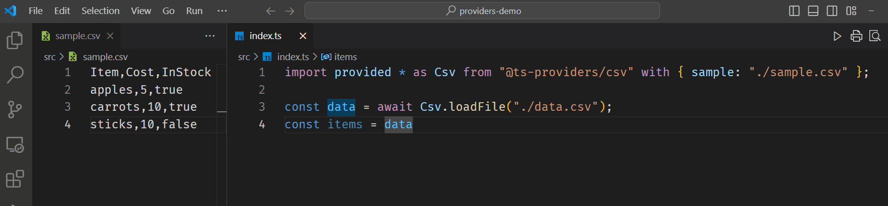

# TypeScript with type providers

**This is an experimental fork of the TypeScript compiler which adds support for F#-style type providers.**



## Installation

You can install the compiler with:

```bash
# Local installation
npm install --save-dev @ts-providers/compiler

# Global instllation
npm install -g @ts-providers/compiler
```

Then it can be invoked with `tsc-providers` command (directly in shell for global installation, or in NPM scripts for local installation). It does not conflict with any existing `tsc` installation.

### VS Code set up

You can use the modified compiler as the language server in VS Code. First, create or modify the file `.vscode/settings.json` under the root of your workspace and, depending on your installation, add settings such as this:

```json
"typescript.tsdk": "./node_modules/@ts-providers/compiler/lib",
"typescript.enablePromptUseWorkspaceTsdk": true
```

Second, restart the editor, open any TypeScript file in the project, and accept the pop-up prompt for changing TypeScript version.

## Usage

There are a few example type provider packages available for basic data formats:

- CSV: `npm install @ts-providers/csv`
- XML: `npm install @ts-providers/csv`
- JSON-Zod (generates Zod validation schema): `npm install @ts-providers/csv`

To use a type provider in your code, add the relevant package and use the `import provided` syntax, e.g.:

```typescript
import provided * as Csv from "@ts-providers/csv" with { sample: "../data/sample.csv" };

const data = await Csv.loadFile("../data/actual.csv");

function processData(data: Csv.Row[]) { ... }
```

This generates types and data access code from the specified sample. The code is used for type checking and is emitted along with your code

You can use "Go to definition" to inspect the 

## Implementing a type provider package

TODO

## Issues

The main issues to be solved for a production-ready implementation:

- Cleaner handling and better caching of the provided AST. Currently, the provided source files are treated as regular files with "virtualized" file paths and identifiers.
- Less hacky async provider execution. This might not have a solution without significant rewrite of the entire compiler which is designed as a fully synchronous program. Currently, async providers are executed synchronously using the Node.js plugin `deasync`.